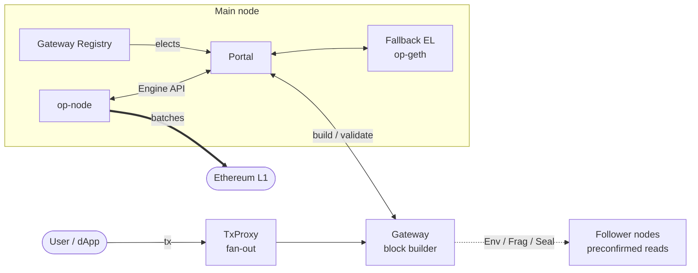
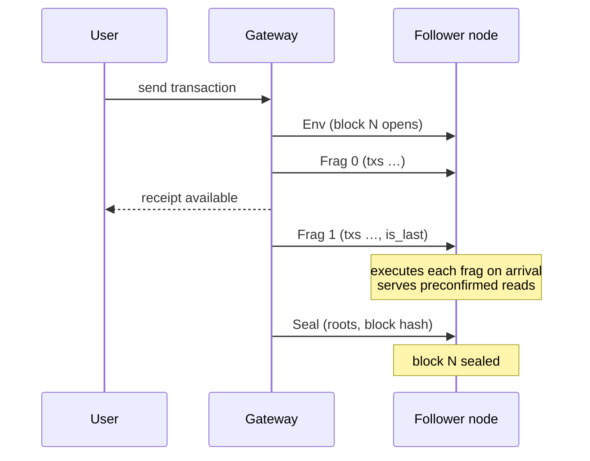

# The based-op Sequencing Stack

**Who this is for:** anyone who wants to understand how a UniFi block is actually produced — where
preconfirmations come from, what a "fragment" is, and how the pieces fit together.

UniFi's sequencing layer is built on [Gattaca's based-op](https://github.com/gattaca-com/based-op),
an implementation of based sequencing for the OP Stack. UniFi runs its own fork and has maintained
and extended it since; this page describes the stack as UniFi runs it, so you do not have to
reconstruct it from upstream material.

:::info
This page covers the **sequencing** half of UniFi. For how L2 state is proven back to L1, see
[TEE Multi Prover](tee-multi-prover.md); for same-slot L1→L2 messaging, see
[Signal Service](signal-service.md).
:::

## The idea in one paragraph

A standard OP Stack chain produces a block, seals it, and only then tells anyone about it. based-op
splits block production into **fragments**: the sequencer streams the block out in pieces while it
is still being built, and other nodes execute those pieces as they arrive. A user's transaction is
visible — with a receipt, and reflected in state reads — as soon as the fragment containing it is
broadcast, rather than when the block seals. That is what a UniFi preconfirmation is.

## Components

| Component | What it does |
|---|---|
| **Gateway** | The block builder. A purpose-built Rust sequencer that simulates and orders transactions, emits fragments as it builds, and seals the block. Holds the key that signs fragments. |
| **Portal** | Sits between the main node's `op-node` and its execution client and multiplexes the Engine API to the elected gateway and to a fallback execution client. Decides whose block becomes canonical (see [Safety](#safety-what-the-portal-guarantees)). |
| **Gateway Registry** | The source of truth for which gateway is sequencing at a given block height. |
| **TxProxy** | Fans incoming transactions out to the gateways so a transaction reaches whoever is currently building. |
| **Fallback execution client** | An ordinary op-geth. Produces a block if the gateway is late or returns something invalid, and validates what the gateway produced. |
| **Follower nodes** | Ordinary EL + CL pairs that consume fragments and serve preconfirmed reads. This is the shape a public RPC endpoint takes. |

## How a block gets built

Block production is a three-message protocol. Each message is signed by the gateway that is
sequencing for that block.

| Message | When | Carries |
|---|---|---|
| **Env** | The gateway starts a block | The block environment: number, parent hash, timestamp, gas limit, base fee, beneficiary, `prevrandao`, `parent_beacon_block_root` |
| **Frag** | Repeatedly, while building | A sequence number, an ordered batch of transactions, and whether it is the last fragment |
| **Seal** | After the block is sealed | The finished header commitments — state root, transactions root, receipts root, gas used, block hash |

Fragments are strictly ordered: a receiving node applies `Frag 0`, then `Frag 1`, and so on, and
refuses to skip. When the fragment marked `is_last` arrives, the receiver computes the block's roots
and pre-seals it. The `Seal` message then confirms the gateway reached the same result, and the
block becomes canonical on that node.

### How fragments travel

Fragments reach other nodes two ways, both already part of the OP Stack's own plumbing:

- **Between nodes** — over the existing `op-node` libp2p gossip, on three additional topics:
  `/optimism/<chain-id>/0/envs`, `/optimism/<chain-id>/0/fragments` and
  `/optimism/<chain-id>/0/seals`. Receiving nodes check the signature against the gateway the
  registry names for that block before acting on the message.
- **Into the execution client** — over three additional Engine API methods: `engine_envV0`,
  `engine_newFragV0` and `engine_sealFragV0`.

An unmodified OP Stack node ignores all of this and follows the chain normally from L1 data; it
simply does not get preconfirmations.

### The unsealed block

The block being assembled from fragments is the **unsealed block**. It is where preconfirmed state
lives, and it is why `latest` on UniFi can be one block ahead of the `latest` *block*. The exact
per-method behaviour is a contract you should read before integrating:
[Preconfirmation RPC Semantics](../reference/preconfirmation-rpc-semantics.md).

## Gateway rotation

The registry maps block heights to gateways deterministically: it divides the target block height by
a fixed interval (30 L2 blocks by default) and indexes into the registered gateway list, so every
node resolves the same gateway for the same height without coordination. Nodes query the registry
for the current and upcoming gateways, which is also how a follower knows whose fragment signature
to accept.

When a gateway takes over, it needs the current L2 state to start issuing preconfirmations
immediately. That is the other reason fragments are gossiped: the incoming gateway has been applying
its predecessor's fragments all along, so there is no gap at the handover.

## Safety: what the portal guarantees

The gateway is a block *builder*, not a trusted authority. When the main node asks for a payload,
the portal asks both the elected gateway and the fallback execution client, and **submits the
gateway's block to the fallback client for validation** before using it. If the fallback client
rejects it, or the gateway is slow or unreachable, the portal serves the fallback client's own block
instead.

So a gateway that misbehaves or stalls costs liveness of *preconfirmations*, not chain safety: it
cannot get an invalid block accepted, and the chain keeps advancing without it.

Two consequences worth internalising as a developer:

- **Preconfirmations are soft.** A preconfirmed transaction is a commitment by the gateway currently
  building, not a settled fact. Until the block is sealed and its batch lands on L1, it can be
  reorged. See [Current status](#current-status) for where this is heading.
- **Sealed is not final.** A sealed L2 block still has to be batched to L1 like any OP Stack block,
  and L1 settlement is what makes it canonical.

## Execution clients

Fragment support is implemented in **both** execution clients UniFi maintains:

- **op-geth** — the client the chain runs on today.
- **op-reth** — a second implementation of the same fragment protocol and preconfirmed-read
  behaviour, wire-compatible with op-geth's.

Maintaining two implementations of the same protocol is deliberate: it keeps the fragment format
honest and gives the proving stack execution-client diversity (see
[TEE Multi Prover](tee-multi-prover.md)).

## What UniFi changed on top of based-op

The block-production design above is upstream based-op and UniFi has kept it. UniFi's own work has
gone into the surfaces around it — the things a developer or an operator actually touches:

| Area | What UniFi added |
|---|---|
| **Preconfirmation RPC contract** | A specified, tested contract for what every `eth_*` method returns during the preconfirmation window — preconfirmed state at `latest`, zero-`blockHash` receipts, sealed-only logs — rather than leaving it emergent. Documented in [Preconfirmation RPC Semantics](../reference/preconfirmation-rpc-semantics.md). |
| **Second execution client** | The op-reth fragment port described above. |
| **Multi-gateway operation** | Registry-served peer discovery so gateways mesh with each other automatically, and failover so nodes follow the gateway that is actually producing rather than only the scheduled one. |
| **Transaction submission** | Transaction results are taken from the gateway that is actually building, so a submission result reflects the builder's decision rather than whichever node answered first. |
| **Fragment observability** | A real-time fragment stream for explorers and indexers, plus metrics for fragment delivery. |
| **Robustness** | Extensive hardening of the gateway's transaction pool, state handling, and RPC input validation. |

## Current status

UniFi runs based-op's **Phase 1** design, and it is worth being precise about what that does and
does not include today.

| | Status |
|---|---|
| Fragment-based preconfirmations | **Live** |
| Multiple gateways with rotation and failover | **Live** |
| Fallback block production | **Live** |
| Preconfirmations backed by collateral and slashing | **Not implemented.** Preconfirmations are soft commitments. |
| Lookahead-based gateway assignment tied to L1 proposers | **Not implemented.** Rotation is by the registry schedule described above. |

The [Gateway](gateway.md) page describes the collateral, slashing and lookahead design these are
heading toward.

## Credits

The sequencing stack originates in [Gattaca's based-op](https://github.com/gattaca-com/based-op).
UniFi maintains a fork with the changes described above.
